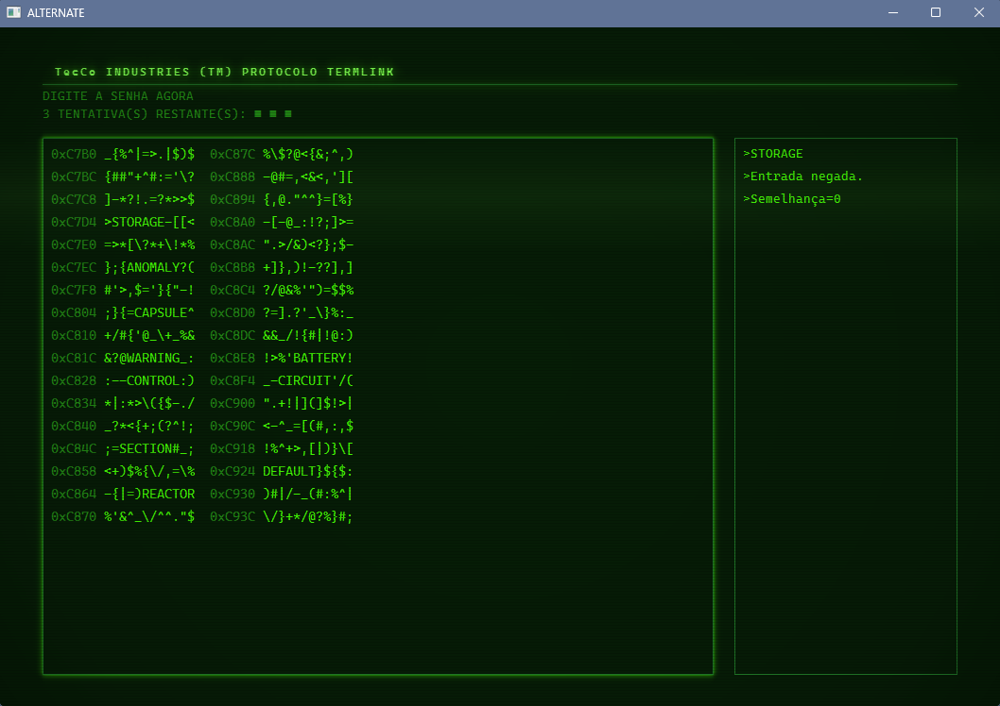

> Read this in English: [README.md](README.md)

# 🌀 Alternate

Ferramenta para Windows inspirada na série *Ruptura*. Alterna o computador entre
**Modo Trabalho** e **Modo Pessoal**: encerra os aplicativos do modo anterior,
inicia os do novo, troca o papel de parede e limpa arquivos temporários.

A interface é uma **GUI em PySide6 sobre um núcleo independente** — o `core.py`
não conhece Qt e conversa com ela pelo contrato `Reporter`.


---

## 📁 Estrutura do projeto

```
Severance-System/
├── assets/                  recursos somente-leitura (vão embarcados no .exe)
│   ├── lang/
│   │   ├── pt.json
│   │   └── en.json
│   └── logo.ico
├── data/                    dados do usuário (ficam AO LADO do .exe)
│   ├── config.json
│   ├── work_apps.json
│   ├── personal_apps.json
│   └── virtual_desktops_backup.json
├── docs/
│   └── manual_python_estudo.md
├── logs/                    reservada (ver "Limitações conhecidas")
├── packaging/
│   ├── severance_gui.spec
│   ├── installer.iss
│   └── build_installer.bat
├── src/
│   ├── core.py              motor: processos, wallpaper, registro, limpeza
│   ├── severance_gui.py     ponto de entrada usado pelo .spec
│   └── gui/                 interface gráfica (PySide6)
├── run_gui.bat              abre a GUI
└── requirements.txt
```

### Por que `data/` e `assets/` são separados

Não é organização cosmética: as duas pastas têm ciclos de vida diferentes quando
o programa é empacotado com PyInstaller.

- **`assets/`** é somente-leitura e vai *dentro* do executável. Ao rodar, o
  PyInstaller descompacta esse conteúdo numa pasta temporária nova a cada
  execução (`sys._MEIPASS`).
- **`data/`** é gravável e precisa **sobreviver** ao fechamento do programa. Se
  o `config.json` fosse embarcado junto dos assets, cada execução começaria com
  a pasta temporária zerada e as suas configurações seriam perdidas.

Quem resolve isso é a camada de caminhos do `core.py`:

| Função | Devolve | Empacotado (`.exe`) |
|---|---|---|
| `get_project_root()` | raiz do projeto | pasta do executável |
| `get_data_dir()` | `data/` (cria se faltar) | `data/` ao lado do `.exe` |
| `get_logs_dir()` | `logs/` (cria se faltar) | `logs/` ao lado do `.exe` |
| `get_asset_path(*p)` | `assets/...` | `sys._MEIPASS/assets/...` |

`get_project_root()` resolve a raiz a partir de `__file__` — **nunca** do
diretório de trabalho. Por isso o programa acha `data/` e `assets/` corretamente
seja qual for a pasta de onde foi iniciado (atalho, terminal ou agendador).

---

## ⚙️ Instalação

Requisitos: **Windows** e **Python 3.13** (testado em 3.13.7 com PySide6 6.11).
O projeto usa APIs exclusivas do Windows (`winreg`, `ctypes.windll`, `winsound`).

```bash
python -m venv venv
venv\Scripts\pip install -r requirements.txt
```

---

## ▶️ Como executar

O `run_gui.bat` abre o programa — ele usa `pythonw.exe`, então não fica um
console atrás da interface. Manualmente:

```bash
cd src
..\venv\Scripts\python.exe -m gui
```

O diretório de trabalho é `src\` para que `-m gui` encontre o pacote e o
`import core` resolva sem `PYTHONPATH`. Os caminhos de `data/` e `assets/` não
dependem disso.

---

## 🖥️ A interface gráfica

**Abertura** — o boot da LUMEN INDUSTRIES, com efeito de fósforo,
scanlines e digitação. Pode ser pulada.

**Aba Controle** — iniciar Modo Trabalho, iniciar Modo Pessoal, limpar cache e
temporários. Um painel de log mostra cada processo encerrado/iniciado.


*O modo ativo aparece em destaque acima dos botões, e o registro de atividade
mostra o que o núcleo está fazendo em tempo real.*

**Aba Banco de Dados** — lista os apps de cada modo, com adicionar, editar e
excluir. *Editar* (ou duplo clique no item) abre o mesmo formulário preenchido:
dá para corrigir nome, caminho e as marcações de administrador e "fechar após
iniciar" — e, trocando o banco no formulário, mover o app entre TRABALHO e
PESSOAL.

**Ajustes (⚙)** — nome de usuário, idioma, tema, efeitos sonoros, minimizar para
a bandeja ao fechar, iniciar bloqueado, papel de parede e restaurar ao padrão.

**Temas** — `severance` (padrão) e `fallout`. A troca é imediata, pelos Ajustes.


*O tema Fallout troca o ciano por fósforo verde e acrescenta o **botão de cadeado**
(🔒) ao lado da engrenagem — ele só aparece neste tema, porque é o que dá acesso
ao terminal Termlink.*

**Tela de bloqueio — só no Fallout.** Atrás desse cadeado está o minigame de
senha do terminal TecCo Termlink: palavras escondidas num despejo de memória,
quatro tentativas e a dica de *likeness*. Além do cadeado, Ajustes › "Iniciar
bloqueado" faz a tela aparecer já na próxima abertura.



*O cabeçalho traz a marca TecCo — a contraparte da Lumen no tema Fallout. As
palavras se escondem no despejo (`STORAGE`, `CAPSULE`, `REACTOR`…) e cada erro
responde com a* semelhança *em vez de uma recusa seca.*

⚠️ **É uma brincadeira, não segurança.** Não protege nem esconde nada: qualquer
um que abra `data/config.json` passa por cima dela.

**Bandeja** — por padrão o X minimiza a janela para a bandeja em vez de encerrar,
e a saída definitiva fica no menu dela. Desmarcando *"Ao fechar, minimizar para a
bandeja"* nos Ajustes, o X passa a encerrar o programa. Passando o mouse sobre o
ícone, o tooltip mostra o modo ativo (`TRABALHO`, `PESSOAL` ou `NENHUM`) — sem
precisar abrir a janela.

**Primeiro uso** — sem nome gravado, a abertura não concede acesso: ela verifica
as credenciais e entrega a tela de cadastro. O menu só aparece depois do nome
informado, seguido de *acesso concedido* e da saudação.

Nenhuma ação roda na thread da interface: tudo passa por um `Worker`, e os
eventos voltam como *signals* Qt. A janela não congela durante uma troca de modo.

---

## 🗂️ Configuração e dados

### `data/config.json`

| Campo | Descrição |
|---|---|
| `language` | `pt` ou `en` |
| `user_name` | seu nome (*innie*) |
| `active_mode` / `active_mode_key` | último modo iniciado |
| `work_wallpaper` / `personal_wallpaper` | `{ "path": ..., "style": "1".."6" }` |
| `theme` | `severance` ou `fallout` |
| `start_locked` | abrir na tela de bloqueio |
| `sound_enabled` | efeitos sonoros do terminal |
| `close_to_tray` | o X minimiza para a bandeja em vez de encerrar (padrão: `true`) |
| `wallpaper_walk_desktops` | percorrer as áreas de trabalho ao aplicar o papel de parede (padrão: `true`) |

### `data/work_apps.json` e `data/personal_apps.json`

```json
[
    {
        "name": "DROPBOX",
        "path": "C:/Program Files (x86)/Dropbox/Client/Dropbox.exe",
        "close_after_launch": true,
        "requires_admin": true
    }
]
```

| Campo | Efeito |
|---|---|
| `name` | rótulo exibido; também casa a janela em `close_after_launch` |
| `path` | caminho do `.exe` ou `.vbs` (`.vbs` roda via `wscript.exe`) |
| `close_after_launch` | fecha a **interface** do app após iniciar (Alt+F4), deixando o processo de fundo vivo |
| `requires_admin` | inicia elevado (`runas`), com prompt do UAC |

Apps presentes nos **dois** modos não são encerrados na troca — só os exclusivos
do modo anterior. Steam e Dropbox têm tratamento especial (`-silent`, encerramento
mais agressivo, silenciamento da saída).

### Estilos de papel de parede

| Código | Estilo |
|---|---|
| `1` | Preencher |
| `2` | Ajustar |
| `3` | Esticar |
| `4` | Lado a lado |
| `5` | Centralizar |
| `6` | Span (múltiplos monitores) |

#### Múltiplas áreas de trabalho virtuais

O papel de parede é aplicado em **todas** as áreas de trabalho virtuais, não só
na ativa. Isso exige um rodeio: `SystemParametersInfoW` repinta apenas a área
ativa, e gravar a chave `Wallpaper` de cada GUID no registro **não basta** — o
Explorer mantém o papel de parede de cada área em memória e só consulta essas
chaves ao iniciar a sessão.

Por isso o sistema faz as duas coisas: grava o registro (para o valor estar certo
no próximo login) e **percorre as áreas** com `Ctrl+Win+Seta`, aplicando de fato
em cada uma e voltando à área de origem no fim. O efeito visível é a tela
alternar por alguns segundos durante a troca de modo.

O percurso só acontece quando há algo a mudar: se o papel de parede alvo (e o
estilo) já estiverem em vigor em todas as áreas, essa etapa é pulada por
completo. Iniciar o mesmo modo duas vezes seguidas não alterna nada.

Para desativar esse percurso — ficando só com a área ativa e o registro —
acrescente ao `data/config.json`:

```json
"wallpaper_walk_desktops": false
```

### Traduções

Cada arquivo em `assets/lang/` vira um idioma automaticamente (o código é o nome
do arquivo). Para adicionar um idioma, copie `pt.json`, traduza os valores e
salve como, por exemplo, `es.json`.

---

## 🧱 Arquitetura

O núcleo não conhece Qt nem idioma. Ele reporta o que está fazendo através do
contrato `core.Reporter`, e a interface o implementa:

```
gui/ ──── QtReporter ──→ core.Reporter ──→ core.py
                                           (processos, registro,
                                            wallpaper, limpeza)
```

A separação é proposital: outra interface só precisa implementar o `Reporter` —
o `core.py` não muda.

| Módulo em `src/gui/` | Papel |
|---|---|
| `__main__.py` / `app.py` | ponto de entrada (`python -m gui`) |
| `main_window.py` | `QStackedWidget`: boot → bloqueio → abas |
| `boot.py` | abertura LUMEN |
| `lockscreen.py` | minigame do terminal Termlink |
| `dialogs.py` | formulários de app (cadastro e edição), ajustes e papel de parede |
| `effects.py` | overlay CRT: fósforo, scanlines, varredura |
| `theme.py` | paletas Severance/Fallout (QSS via `string.Template`) |
| `sound.py` | tons WAV assíncronos em memória |
| `reporter.py` | `Worker` + ponte núcleo → signals Qt |
| `i18n.py` | tradução em runtime, limpando a marcação do `rich` que os arquivos de idioma ainda carregam |

---

## 📦 Gerar o executável e o instalador

O caminho curto é `packaging\build_installer.bat`, que faz os dois passos e avisa
com clareza se algo faltar. Manualmente:

```bash
venv\Scripts\pyinstaller packaging\severance_gui.spec   # -> dist\Alternate.exe
iscc packaging\installer.iss                            # instalador -> dist\Alternate-2.0.0-setup.exe
```

O executável tem **~60 MB**: leva o Python e o PySide6 inteiros dentro de
si, e por isso roda em máquinas sem nada instalado.

O instalador exige o [Inno Setup 6](https://jrsoftware.org/isdl.php), que é
gratuito. Sem ele, o `.bat` ainda entrega o executável de `dist\`, que já
funciona sozinho — o instalador só acrescenta atalhos e desinstalação.

**Instalação por usuário, de propósito.** O destino padrão é
`%LOCALAPPDATA%\Programs\Alternate`, e não Arquivos de Programas. Isso
evita o UAC na instalação e deixa o destino gravável, então `data/` fica ao lado
do executável e a pasta inteira pode ser levada para outro PC.

**Onde os dados param.** O `.spec` embarca `assets/` e mantém `data/` de fora —
o PyInstaller apaga a pasta temporária a cada saída, então qualquer coisa gravada
lá se perderia. Se ainda assim o programa acabar numa pasta protegida, ele não
quebra: `core._writable_dir` testa a escrita e cai para
`%APPDATA%\Alternate\`.

**Instalação nova começa zerada.** Nem o executável nem o instalador carregam o
`config.json` ou os bancos de apps — o `.spec` deixa `data/` de fora e o
instalador leva só o `.exe` e os READMEs. Sem `user_name` gravado, a abertura não
concede acesso e entrega a tela de cadastro, então cada usuário define o próprio
perfil.

> O instalador usa um `AppId` próprio, diferente do antigo Severance System. Para
> o Windows, o Alternate é outro produto: instala em pasta própria e não herda o
> `data/` da instalação anterior. A entrada antiga, se existir, continua em
> Aplicativos e pode ser desinstalada à parte.

Desinstalar preserva `data/` de propósito — atualizar não apaga seus ajustes.
Para zerar, apague a pasta manualmente.

---

## ⚠️ Limitações conhecidas

- **O instalador não é assinado digitalmente.** O SmartScreen do Windows vai
  alertar na primeira execução ("Mais informações" → "Executar assim mesmo").
  Resolver isso exige um certificado de assinatura de código pago.
- **`assets/logo.ico` não está no repositório**, então o executável e o
  instalador saem com o ícone padrão do Windows e a GUI desenha um quadrado da
  cor do tema. O `.spec` trata a ausência sem quebrar; devolvendo o arquivo a
  `assets/`, o ícone volta sozinho (e basta descomentar `SetupIconFile` no
  `installer.iss`).
- **`logs/` não é usada por nada.** A pasta e o `core.get_logs_dir()` existem,
  mas o projeto não tem sistema de log — é estrutura pronta, não recurso ativo.
- **A limpeza de desktops virtuais órfãos ficou inalcançável.** A CLI era a única
  que chamava `core.clean_orphan_virtual_desktops()`; com ela removida, a função
  continua no núcleo mas ninguém a invoca. O botão de manutenção da GUI limpa só
  cache e temporários.
- **Somente Windows.** `winreg`, `ctypes.windll` e `winsound` não têm equivalente
  nas outras plataformas.
- A limpeza de temporários ignora arquivos em uso pelo sistema — é esperado ver
  vários "permissão negada" no log.
